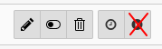

# What does it do?

With the "Run task" button in TYPO3's scheduler module can easily run in memory_limit or timeout exceptions. This
extension simply removes the button from scheduler, so you cannot click it by mistake.

# Install

Run `composer require koehnlein/scheduler-disable-runtask` and enable the extension in your extension manager.
